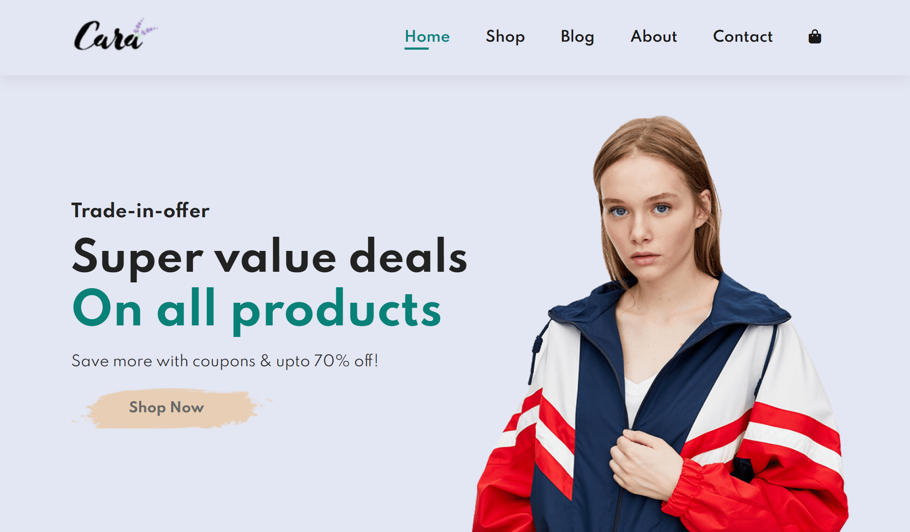

<!-- ========================= BADGES ========================= -->

[](https://developer.mozilla.org/en-US/docs/Web/Guide/HTML/HTML5)
[](https://developer.mozilla.org/en-US/docs/Web/CSS)
[](https://developer.mozilla.org/en-US/docs/Web/JavaScript)
[](LICENSE)
[](https://github.com/madashivakarthikgoud/ecommerce)

# Ecommerce Template

> A sleek, static multi-page storefront boilerplate built with vanilla HTML, CSS & JavaScript.

🔗 **Live Demo:** [https://madashivakarthikgoud.github.io/ecommerce/](https://madashivakarthikgoud.github.io/ecommerce/)

---

## 🚀 Features

* **Responsive Design**: Mobile-first layout with CSS grid and flexbox ensures perfect rendering across devices.
* **Vanilla JS Cart**: Lightweight cart logic—add/remove products, update quantities, live total calculation.
* **Modular CSS**: Single `style.css` using CSS variables and utility classes for rapid theming.
* **Multi-Page Structure**: Ready-to-use pages: Home, Shop, Product, Cart, Blog, About, Contact.
* **Zero Build Tools**: Clone & open `index.html`; no bundlers or package managers required.

---

## 🎨 Screenshot

<!-- Replace with actual screenshots in docs/screenshots/ -->

| Home                               |
| ---------------------------------- |
|  |

---

## 📂 File Structure

```text
ecommerce/
├── index.html     # Home page with hero and featured products
├── shop.html      # Product listing grid
├── sproduct.html  # Single product detail view
├── cart.html      # Shopping cart interface
├── blog.html      # Blog listing template
├── about.html     # About us / company info
├── contact.html   # Contact form page
├── style.css      # Core styles, variables, utilities
└── script.js      # Cart & UI scripts
```

---

## 💻 Quick Start

1. **Clone the repo**

   ```bash
   git clone https://github.com/madashivakarthikgoud/ecommerce.git
   cd ecommerce
   ```
2. **Preview locally**

   * **Double-click** `index.html`
   * OR serve with a static server:

     ```bash
     npx serve .
     ```
3. **Customize**

   * Edit CSS variables in `style.css`
   * Modify HTML pages or integrate with your backend

---

## 🤝 Contributing

We ❤️ contributions! Steps:

1. **Star** this repo ⭐
2. **Fork** the project
3. Create your feature branch (`git checkout -b feature/YourFeature`)
4. Commit your changes (`git commit -m 'Add new feature'`)
5. Push to the branch (`git push origin feature/YourFeature`)
6. Open a **Pull Request**

Let's build something awesome together!

---

## ⚖️ License

This project is licensed under the **MIT License**. See [LICENSE](LICENSE) for details.

---

*Crafted with ❤️ by Shiva Karthik*\*
